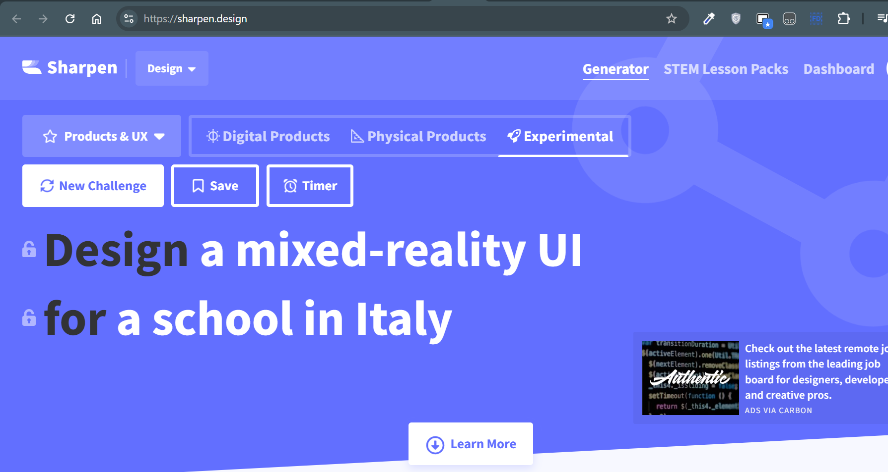

# Framework Challenge – Mixed-Reality School UI 🇮🇹

## 🔖 Prompt
**"Design a mixed-reality UI for a school in Italy"**  
_Sourced from [Sharpen.design](https://sharpen.design)_

## 🎨 Framework Used
[MVP.css](https://andybrewer.github.io/mvp/)

## 💡 Features
- AR-enhanced classroom view
- VR-based remote student interface
- Integrated teacher dashboard for managing both realms
